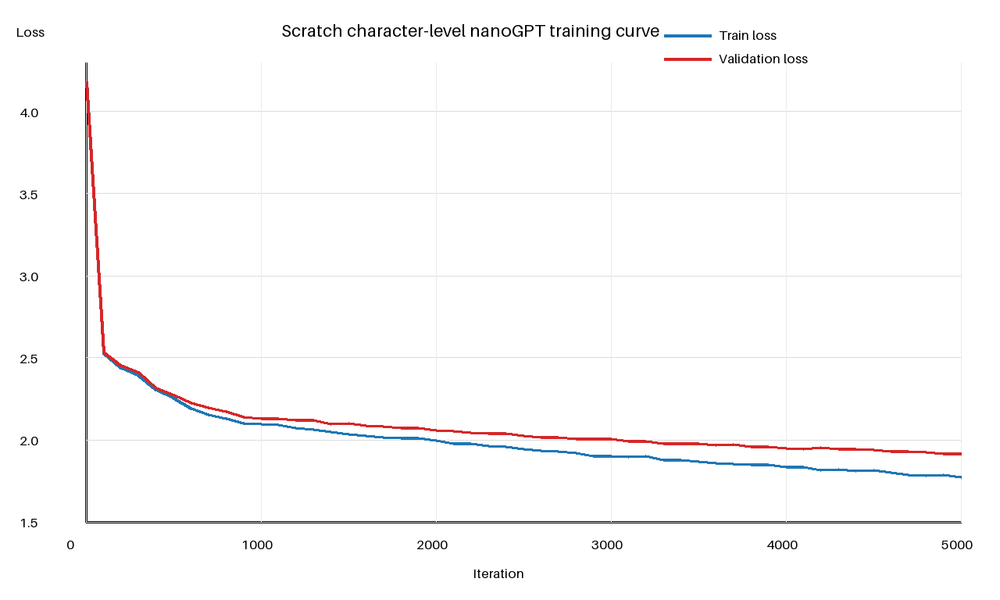
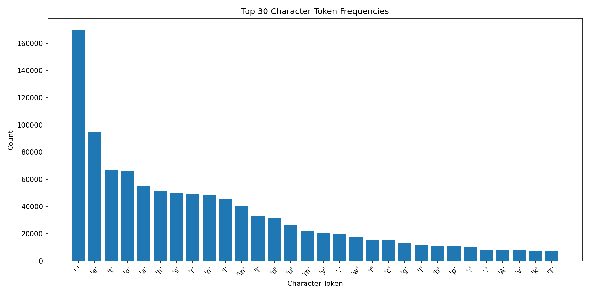
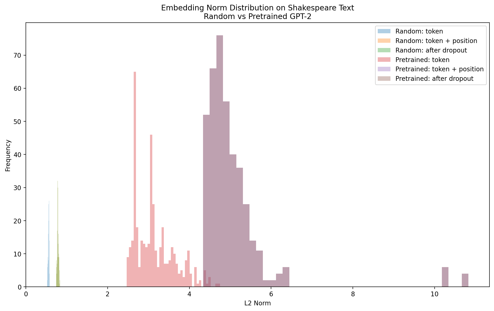

# AIAA nanoGPT Experiment Summary

## 1. Experiment Overview

This report summarizes four related experiment tracks. The scratch experiment trains a small, randomly initialized, character-level nanoGPT on `shakespeare_char`. The pretrained and fine-tuned GPT-2 experiments use GPT-2 byte-pair encoding (BPE) and the prepared `shakespeare` validation split. Task 6 compares previously recorded GPT-2 question-answering continuations with one inference run of `Qwen/Qwen2.5-0.5B-Instruct`, using Qwen's chat template.

These tracks answer different questions. Character-level scratch training demonstrates learning from random initialization; the GPT-2 pair supports a controlled pretrained-versus-fine-tuned comparison; Qwen demonstrates instruction-following behavior. Character-level and GPT-2 BPE losses are **not directly comparable** because their tokenization and model setups differ.

## 2. Runs, Configurations, and Core Metrics

### Completed runs and results

| Experiment | Run | Parameters | Core recorded results |
|---|---|---:|---|
| Scratch character nanoGPT | `ll3vo21e` — `shakespeare-char-scratch` | 812,288 | Final validation loss 1.67235; training throughput 161,802.53 tokens/s |
| Pretrained GPT-2 evaluation | `k6sxm27c` — `gpt2-pretrained-shakespeare-eval` | 124,439,808 | Validation loss 3.99624; perplexity 54.3933; evaluation throughput 172,724.29 tokens/s; peak GPU memory 4,711.05 MB |
| GPT-2 fine-tuning | `ermv6omj` — `gpt2-finetune-shakespeare` | 124,439,808 | Best/final validation loss 3.24544; perplexity 25.6730; evaluation throughput 163,805.65 tokens/s; training throughput 64,226.63 tokens/s; peak GPU memory 4,073.75 MB. Best checkpoint: iteration 100 |
| GPT-2 versus Qwen QA | `49o4zyt7` — `qwen2.5-0.5b-instruct-vs-gpt2-qa` | GPT-2/Qwen values logged by the run; exact Task 6 values not verified in the local repository | Five-prompt qualitative comparison in `qa/model_comparison`; project `aiaa-nanogpt-task6` |

### Configuration evidence

| Setting | Scratch nanoGPT | GPT-2 pretrained | GPT-2 fine-tuned | Task 6 Qwen QA |
|---|---|---|---|---|
| Dataset / input source | `shakespeare_char` | `shakespeare` | `shakespeare` | Five fixed Chinese QA prompts; GPT-2 outputs reused from `reports/task11_instruct_comparison.json` |
| Tokenizer | Character | GPT-2 BPE | GPT-2 BPE | GPT-2 historical output; Qwen tokenizer with chat template |
| Initialization | Random (`scratch`) | `GPT.from_pretrained("gpt2")` | `GPT.from_pretrained("gpt2")` | `Qwen/Qwen2.5-0.5B-Instruct`; no training |
| Architecture | 4 layers, 4 heads, embedding 128, dropout 0.2 | GPT-2 124M family | Same GPT-2 124M family | Qwen architecture loaded from Hugging Face; exact local configuration not verified |
| Block size | 128 | 1,024 | 1,024 | Model/tokenizer managed; no fixed nanoGPT block size |
| Batch size | 32 | 4 | 4 | One prompt at a time |
| Gradient accumulation | 1 | 1 | 8 | Not applicable |
| Learning rate | 0.001 | Not applicable | 0.00003 | Not applicable |
| Maximum iterations | 5,000 | Eval-only | 100 | Inference-only |
| Evaluation schedule | Every 100 steps; 50 batches | One evaluation; 50 batches | Every 10 steps; 50 batches | One five-prompt generation pass |
| Seed | 1,337 | 1,337 | 1,337 | 1,337 |
| Device / dtype | CUDA requested by `train.py`; dtype determined by runtime defaults | CUDA requested; runtime dtype determined by `train.py` | CUDA requested; runtime dtype determined by `train.py` | CUDA when available; bfloat16 on CUDA, float32 on CPU |
| Generation | 64 new tokens; greedy argmax in W&B helper | 64 new tokens; greedy argmax | Same prompts and 64-token greedy generation before/after | 256 new tokens maximum; greedy (`do_sample=False`); Qwen chat template |

The configuration values above come from the checked-in Task 2–6 configuration and logging code. Device availability and exact runtime dtypes are environment-dependent unless recorded by the individual W&B run.

## 3. Scratch Training Curve



*Figure 1. Train and validation loss parsed from 51 evaluation records in `reports/task2_train.log`; no training was rerun.*

Both curves fall sharply during the first few hundred iterations and then improve more gradually through iteration 5,000. Validation loss remains close to, but consistently above, training loss. The gap increases slowly in the later portion, suggesting a modest generalization gap, but the validation curve continues to trend downward and shows no visible instability or late-stage divergence. This historical log ends at validation loss 1.9145; the W&B run's reported final validation loss is 1.67235, so the figure should be interpreted as the locally preserved training-log trajectory rather than a reconstruction of every W&B point.

## 4. GPT-2 Pretrained vs Fine-tuned

| Metric | GPT-2 Pretrained | GPT-2 Fine-tuned | Change after fine-tuning |
|---|---:|---:|---:|
| Validation loss | 3.99624 | 3.24544 | −0.75080 (−18.79%) |
| Perplexity | 54.3933 | 25.6730 | −28.7203 (−52.80%) |
| Parameter count | 124,439,808 | 124,439,808 | No change |
| Evaluation throughput | 172,724.29 tokens/s | 163,805.65 tokens/s | −8,918.64 tokens/s |
| Peak GPU memory | 4,711.05 MB | 4,073.75 MB | −637.30 MB |

This loss/perplexity comparison is meaningful because both runs use the GPT-2 architecture family, GPT-2 BPE Shakespeare data, and the same validation setup. The checked-in configurations currently use `eval_iters=50` for both, but batch size and other historical run settings must be interpreted from the logged run configuration: the pretrained configuration was changed during Task 5 from batch size 8 and 500 evaluation batches to batch size 4 and 50 evaluation batches. Throughput and memory therefore remain workload- and configuration-dependent even when loss is comparable. The scratch character-level loss is not included in this comparison.

## 5. Token Frequency and Embedding Norm



*Figure 2. Counts of the 30 most frequent character tokens in the Shakespeare character corpus.* Space is the dominant token, followed by common English letters such as `e`, `t`, and `o`; the long-tailed counts are consistent with ordinary text rather than a uniform character distribution.



*Figure 3. L2-norm distributions for random and pretrained GPT-2 token embeddings, token-plus-position embeddings, and post-dropout representations on Shakespeare text.* The pretrained distributions are shifted to substantially larger norms than the random initialization. The stored statistics report mean token norms of 0.5554 (random) and 3.1508 (pretrained), and mean token-plus-position norms of 0.7824 and 5.0675, respectively. In evaluation mode, the post-dropout distributions coincide with token-plus-position distributions, as expected when dropout is inactive.

## 6. Fixed-Prompt Generation Comparison

The following outputs are reproduced from `reports/gpt2_before_after_finetune.jsonl` (100 new tokens, temperature 0.8, top-k 200, seed 42). They are a separate stored comparison from the 64-token greedy W&B helper.

| Prompt | Pretrained GPT-2 | Fine-tuned GPT-2 | Observation |
|---|---|---|---|
| `ROMEO:` | “He was really crazy… GUEST STAR…” followed by modern sports-style prose | “'Tis true…” followed by speaker labels including `POLUSIA` and verse-like lines | Fine-tuning shifts the continuation toward dramatic dialogue and Shakespeare-like diction, although names and phrasing remain imperfect. |
| `JULIET:` | “He was really angry…” followed by `HENRY KINSON`/`KINSON` dialogue | “'Tis true; let him go…” followed by repeated `CONNOR`/`GLOUCESTER` turns | The fine-tuned output adopts play-script formatting and period-like language, but becomes repetitive. |
| `To be, or not to be` | Continues as modern argumentative prose about benefits, bargaining, and the gold standard | Continues with `LADY CAPULET` and `NORTHUMBERLAND` in verse-like dialogue | The fine-tuned model adapts strongly toward Shakespeare-style characters and line structure; local coherence is still limited. |

These are behavioral observations only. The outputs are not evidence of factual accuracy or broad language quality.

## 7. GPT-2 vs Qwen Instruct QA Comparison

Task 6 run [`49o4zyt7`](https://forge.coreweave.com/wandb/qma662-hkust/aiaa-nanogpt-task6/runs/49o4zyt7?nw=nwuserqma662), named `qwen2.5-0.5b-instruct-vs-gpt2-qa`, logs one five-row W&B Table under `qa/model_comparison`. Its columns are `prompt`, `GPT-2 output`, `Qwen output`, `instruction following`, `Chinese expression`, and `answer completeness`.

The implementation reuses existing GPT-2 QA text and runs Qwen inference once with its instruction/chat template. The table is intended to reveal differences in continuation and instruction-following behavior, not to establish a controlled model-quality benchmark. In particular, the historical GPT-2 evaluation runtime and Qwen's total QA-generation runtime represent different workloads and must not be treated as a fair speed comparison.

## 8. W&B / Forge Links

- [Task 5 model-comparison group](https://forge.coreweave.com/wandb/qma662-hkust/aiaa-nanogpt-comparison/groups/task5-model-comparison/workspace?nw=nwuserqma662)
- [Task 5 comparison project](https://forge.coreweave.com/wandb/qma662-hkust/aiaa-nanogpt-comparison/workspace?nw=nwuserqma662)
- [Task 6 QA run](https://forge.coreweave.com/wandb/qma662-hkust/aiaa-nanogpt-task6/runs/49o4zyt7?nw=nwuserqma662)

Run IDs: scratch `ll3vo21e`; GPT-2 pretrained `k6sxm27c`; GPT-2 fine-tuned `ermv6omj`; Task 6 QA `49o4zyt7`.

## 9. Artifact

The best fine-tuned checkpoint is recorded as W&B Artifact `nanogpt-gpt2-finetuned-checkpoint:v4`, with aliases `best` and `latest`. It was produced by run `ermv6omj` and contains `ckpt.pt` at checkpoint iteration 100 with validation loss 3.24544. An exact Artifact URL was not verifiable from local repository metadata, so none is invented; use the producing run ID and the Task 5 project link above to locate it.

## 10. Reproduction Commands

Run GPU work through Slurm rather than on the login node. From the repository root, after preparing the corresponding datasets and activating the documented environment:

```bash
# Task 2: scratch character-level training
python train.py config/train_shakespeare_char_scratch_wandb.py

# Task 3: pretrained GPT-2 evaluation
python train.py config/eval_gpt2_pretrained_wandb.py

# Task 4: GPT-2 fine-tuning (checked-in Slurm script)
sbatch slurm/task4_gpt2_finetune.slurm
```

Task 6 uses the isolated `qwen-task6` environment. No Task 6 Slurm script is checked in, so request a GPU allocation and run the checked-in script/config explicitly:

```bash
module load anaconda3
source "$(conda info --base)/etc/profile.d/conda.sh"
conda activate qwen-task6

srun --partition=emergency_gpua40 \
  --qos=emergency_gpua40 \
  --gres=gpu:1 \
  --cpus-per-task=4 \
  --mem=16G \
  --time=00:30:00 \
  python scripts/task6_qwen_qa_comparison.py config/task6_qwen_qa_wandb.py
```

Only the Task 4 `sbatch` command is cited because it is the only matching Task 2–6 Slurm script present in this checkout. The direct Task 2/3 commands should likewise be placed inside an appropriate Slurm allocation or site-specific batch script.

## 11. Reproducibility Notes / Limitations

1. Scratch character-level loss and GPT-2 BPE loss/perplexity are not directly comparable because their tokenization, vocabulary, architecture, and sequence setups differ.
2. Pretrained-versus-fine-tuned GPT-2 loss and perplexity are substantially more meaningful because both use GPT-2 BPE Shakespeare validation data and the same architecture family. Historical configuration changes, including evaluation batch count and batch size, should still be checked in W&B before attributing small differences.
3. Runtime, memory, and throughput depend on hardware, precision, sequence length, batching, compilation, and the measured workload.
4. Task 6 is a behavioral instruction-following observation, not a controlled benchmark of model quality.
5. Historical GPT-2 evaluation runtime and Qwen QA-generation runtime are different workloads and are not a fair speed comparison.

